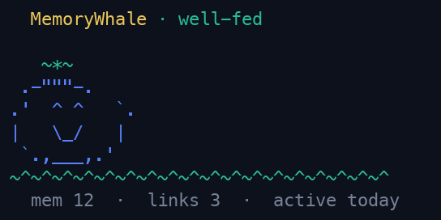

<p align="center">
  
</p>

<h1 align="center">MemoryWhale</h1>

<p align="center"><strong>Persistent local debugging memory for developers and coding agents.</strong></p>

<p align="center"><a href="README.zh-CN.md">中文 README</a> · <a href="README.ko.md">한국어 README</a></p>

<p align="center">
  <a href="https://github.com/wuisabel-gif/MemWhale/actions/workflows/ci.yml"></a>
  <a href="https://github.com/wuisabel-gif/MemWhale/releases"></a>
  <a href="https://crates.io/crates/memorywhale-cli"></a>
  
  
</p>

MemoryWhale records what actually happened while you debug: commands, output,
failures, and the fixes that worked. It stores that evidence in local SQLite so
you and your coding agents can find it after the terminal, SSH connection, or
agent session is gone.

## Why MemoryWhale

- **Remember what actually happened.** Preserve the command, environment,
  output, failure, and lesson—not only a shell-history line.
- **Use one memory across coding agents.** Any compatible stdio MCP client can
  read and write the same local memory through `mw-mcp`.
- **Keep development history local.** MemoryWhale works without an account,
  hosted service, or per-token memory bill.

MemoryWhale records development experience, not everything. It is a debugging
memory layer, not an autonomous coding agent, a general-purpose personal memory
system, or a replacement for project documentation.

## Install

Prebuilt binaries are available for Linux x86_64/aarch64 and macOS:

```bash
curl -fsSL https://raw.githubusercontent.com/wuisabel-gif/MemWhale/main/install.sh | sh
```

Or install with Cargo or Homebrew:

```bash
cargo install memorywhale-cli

brew tap wuisabel-gif/memorywhale https://github.com/wuisabel-gif/MemWhale
brew install memorywhale
```

Windows users can run MemoryWhale inside
[WSL](https://learn.microsoft.com/windows/wsl/). See the
[getting-started guide](docs/guides/getting-started.md) for package installs,
PATH setup, and platform notes.

## Sixty-second example

```bash
mw global on                         # capture future interactive shell commands
mw-run -- cargo check                # capture one command and its output
mw remember "the linker needed libssl-dev"
mw search "linker error"             # recover the failure and its fix
mw context --last-error              # compact context for any agent or chat
mw pet                               # check your memory store's mood
```



For longer work, `mw --live` records a crash-resistant shell session. `mw tui`
opens an interactive terminal browser, while `mw-serve` starts the local web
dashboard.

## How it works

```text
CAPTURE                 MEMORY                 RETRIEVAL
shell / mw-run ──────► local SQLite ────────► search / context
agent hooks ─────────► evidence + lessons ──► similar failures
                                                   │
                                              INTERFACES
                                      CLI / MCP / TUI / Web / Desktop
```

Capture and retrieval are independent. MCP gives an agent access to existing
memory; it does not automatically record normal terminal activity. See the
[architecture](docs/architecture.md) and
[capture concept](docs/concepts/capture.md) for the complete model.

## Works with your coding agent

`mw-mcp` is the common integration seam: a local stdio MCP server exposing six
memory tools. Existing guides cover Claude Code, Claude Desktop, Cursor, VS
Code / GitHub Copilot, Windsurf, Zed, Codex CLI, Cline, Continue, Gemini CLI,
Goose, OpenClaw, CrowClaw, Hermes Agent, and other compatible clients.

```bash
claude mcp add memorywhale -- mw-mcp
```

Clients do not all provide the same capabilities. MCP supports memory access;
automatic execution capture requires a client-specific hook. The
[integration matrix](integrations/README.md) distinguishes access, capture, and
memory-use guidance and links every verified setup guide.

## Who is MemoryWhale for?

MemoryWhale is for developers whose debugging context is scattered across
terminal scrollback, shell history, machines, and temporary agent sessions. It
is especially useful when you:

- debug builds, dependencies, Git, environments, or deployments;
- use coding agents across sessions or switch between tools;
- work over SSH or across multiple development machines;
- want recurring failures and their fixes to remain searchable;
- prefer local storage over a hosted memory service.

See [Use cases](docs/concepts/use-cases.md) for each of these as an
end-to-end scenario with real commands.

## Documentation

- [Documentation map](docs/README.md)
- [Getting started](docs/guides/getting-started.md)
- [`mw pet` reference](docs/reference/pet.md)
- [Terminal capture](docs/guides/terminal-capture.md)
- [Agent memory](docs/guides/agent-memory.md)
- [CLI reference](docs/reference/cli.md)
- [MCP reference](docs/reference/mcp.md)
- [Security and local threat model](docs/SECURITY.md)
- [Integration guides and capability matrix](integrations/README.md)

## Contributing

MemoryWhale accepts changes that improve capturing, preserving, retrieving, or
sharing development experience. Read [CONTRIBUTING.md](CONTRIBUTING.md) for the
scope rule, development commands, and pull-request checklist.

Licensed under the [MIT License](LICENSE).
