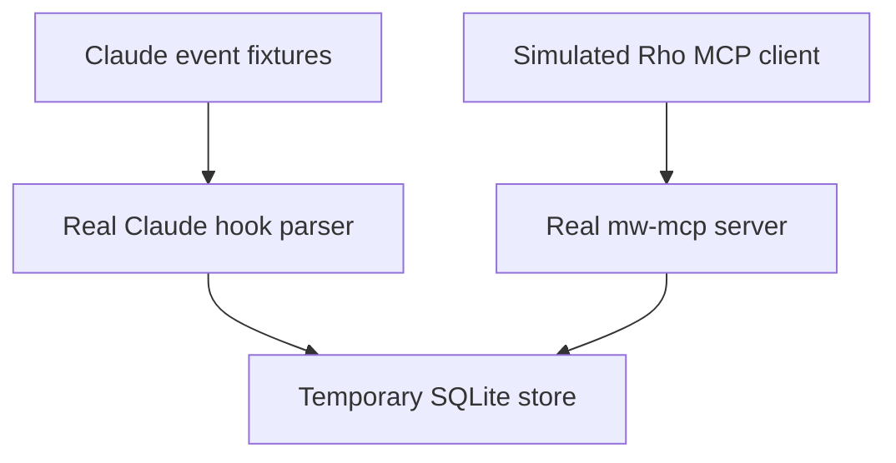

# Cross-agent handoff: Claude to Rho

This walkthrough exercises the Agent-Native Memory interfaces in MemoryWhale
0.10.0. It is deterministic and offline: Claude events are checked-in fixtures,
and a shell script **simulates a Rho MCP client** by sending handcrafted JSON
requests to the real `mw-mcp` binary. It does not launch Claude Code or Rho,
call a model provider, or execute the Cargo commands described in the fixtures.
It uses a real temporary SQLite database, not your normal memory store. Once
the helpers are built, the demo needs no API key or network connection.

## What it demonstrates



Normal terminal activity remains separate:

```text
Claude hook capture       agent=claude
ordinary terminal command agent=NULL, displayed/filtered as terminal
```

MCP access alone does not capture commands. Here, invoking
`mw-remember --from-hook claude` records the fixture event; no live client hook
is installed or triggered. The source remains `command` in both cases.

## Run the offline demo

Build the CLI helpers from the repository root:

```bash
cargo build --release -p memorywhale-cli --bins
```

The demo also requires Bash and Python 3. Python validates the MCP response
objects; the installed Rust capture hooks themselves do not require Python.

Run with those release binaries:

```bash
MW_BIN=target/release/mw \
MW_REMEMBER_BIN=target/release/mw-remember \
MW_MCP_BIN=target/release/mw-mcp \
scripts/agent-handoff-demo.sh
```

The script creates a temporary data directory, runs the Claude hook parser with
both `tests/fixtures/agent-handoff/claude-post-tool-use-failure.json` and
`tests/fixtures/agent-handoff/claude-post-tool-use-success.json`, verifies the
stored/searchable `agent:claude` failure and fixture-provided success, records a
separate terminal command, and simulates the legacy `initialize`, `notifications/initialized`,
`tools/list`, and `search_memory` requests to the actual `mw-mcp` binary.

The assertions verify:

- fixture evidence is stored and searchable with Claude provenance;
- the terminal-only command is excluded by the Claude filter and included by
  the terminal filter;
- the real MCP server handles the simulated client's handshake, tool listing,
  and search request, with the expected response IDs and no protocol/tool errors;
- both the fixture's failure and proposed fix remain retrievable with Claude
  provenance, without leaking the terminal-only record into those results.

Successful output ends with:

```text
Offline handoff verified. Agent events and command outcomes were simulated, not executed.
```

This is a parser/storage/retrieval demonstration, **not proof that Rho ran,
that a model used the evidence, or that the proposed fix works**. The success
fixture says `cargo test -p demo --no-default-features` passed, but this demo
does not run that command. Passing this protocol fixture is not independent
verification of a live handoff or Cargo result, nor a test of HTTP transport.

Without the environment overrides the script looks in `target/debug`.

## Use real integrations

For real local clients, install the verified integrations first:

```bash
mw integrate claude
mw integrate rho
```

Then start each client with access to the same local data directory. Use
`mw doctor` to check MCP, automatic capture, and skill status independently.
The exact provider/model can vary; the durable handoff contract is the shared
local store and the structured agent provenance. To verify a real handoff,
run a real failing command and its fix in the first client, then ask the second
client to retrieve that evidence; report the exact commands and exit codes
separately from this fixture demo.

Rho's current hook payload lacks shell command text and stdout. Failed or
unavailable calls can be retained with a sentinel command and failure metadata;
successful calls without command text are skipped. Consult the
[Rho guide](../../integrations/rho/README.md) before assuming full command
capture. The skill provides guidance, not automatic task-start recall,
failure lookup, or pre-compaction saving.

Do not commit real hook payloads, transcripts, API keys, personal paths, or
provider output. Use the sanitized fixture and temporary data directory for
repeatable documentation and CI.
