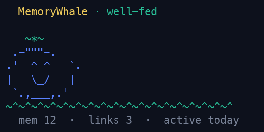

<!-- README-SOURCE-SHA256: 6d60247f5079cb8abf55ba8d3a3e7aac56a1e19926c4db97818637ad8b178d3f -->

<p align="center">
  
</p>

<h1 align="center">MemoryWhale</h1>

<p align="center"><strong>Memória de depuração local e persistente para desenvolvedores e agentes de programação.</strong></p>

<p align="center" dir="ltr"><a href="../../README.md">English README</a> · <a href="../../docs/i18n/README.ar.md" lang="ar">العربية</a> · <a href="../../docs/i18n/README.de.md" lang="de">Deutsch</a> · <a href="../../docs/i18n/README.fr.md">README français</a> · <a href="../../docs/i18n/README.zh-CN.md">简体中文 README</a> · <a href="../../docs/i18n/README.zh-TW.md">繁體中文 README</a> · <a href="../../docs/i18n/README.ko.md">한국어 README</a> · <a href="../../docs/i18n/README.ja.md">日本語 README</a> · <a href="../../docs/i18n/README.es.md" lang="es">Español</a> · <a href="../../docs/i18n/README.pt-BR.md" lang="pt-BR">Português (Brasil)</a></p>

<p align="center">
  <a href="https://github.com/wuisabel-gif/MemWhale/actions/workflows/ci.yml"></a>
  <a href="https://github.com/wuisabel-gif/MemWhale/releases"></a>
  <a href="https://crates.io/crates/memorywhale-cli"></a>
  
  
</p>

<p align="center">
  
</p>

**Você esbarra em um erro. O MemoryWhale lembra que você já o viu antes e devolve a correção.**

O MemoryWhale registra o que realmente aconteceu enquanto você depura: comandos,
saída, falhas e as correções que funcionaram. Ele guarda essas evidências em um
SQLite local para que você e seus agentes de programação possam encontrá-las
depois que o terminal, a conexão SSH ou a sessão do agente já tiverem acabado.
Funciona com 19 agentes de programação via MCP, sem conta e sem enviar nada.

> No [LongMemEval](../../benchmarks/longmemeval/README.md), um benchmark público de memória de longo prazo, a
> busca coloca uma sessão que contém a resposta entre os 5 primeiros resultados
> em **97%** de 470 perguntas (apenas recuperação, sem modelo).
>
> Em uma avaliação controlada com bugs específicos de projeto, um agente resolveu
> **25%** sem memória e **96%** com ela. São tarefas sintéticas que demonstram o
> mecanismo, não um estudo de campo. Veja
> [como foi medido](../../benchmarks/README.md).

**MemoryWhale 0.16.0: Proactive Recall · 2 de outubro de 2026.**
A CLI, a interface web e o app desktop compartilham a versão de produto 0.16.0;
o núcleo Rust reutilizável está na versão 0.8.0. Consulte as [notas de versão](https://github.com/wuisabel-gif/MemWhale/blob/v0.16.0/docs/releases/0.16.0.md)
para o guia de atualização. Ao abrir uma base, ela é migrada do schema 10 para o 13.

<p align="center">
  
</p>

**Quer contribuir?** Comece pela [issue Start here](https://github.com/wuisabel-gif/MemWhale/issues/317).
Muitas tarefas não exigem Rust, incluindo revisões de tradução e correções na documentação.

## Por que o MemoryWhale

- **Lembre o que realmente aconteceu.** Preserve o comando, o ambiente, a
  saída, a falha e a lição, não apenas uma linha do histórico do shell.
- **Use uma só memória entre agentes de programação.** Qualquer cliente MCP
  stdio compatível pode ler e gravar na mesma memória local por meio de `mw-mcp`.
- **Mantenha o histórico de desenvolvimento local.** O MemoryWhale funciona sem
  conta, sem serviço hospedado e sem cobrança de memória por token.

O MemoryWhale registra a experiência de desenvolvimento, não tudo. Ele é uma
camada de memória para depuração, não um agente de programação autônomo, nem um
sistema de memória pessoal de uso geral, nem um substituto para a documentação
do projeto.

## Novidades do Agent-Native Memory

- **Conecte e inspecione agentes.** Instale o acesso MCP para Claude Code ou
  Rho, os hooks de captura e as orientações de uso da memória com
  `mw integrate`; `mw doctor` verifica MCP, hooks e skills de forma independente.
- **Deixe a procedência explícita.** O schema 10 armazena os agentes dos
  comandos como `claude`, `rho` ou `NULL`. O rótulo de exibição e filtro
  `terminal` indica procedência de terminal/manual ou legada, não prova de que
  uma pessoa executou o comando. A identidade do agente é separada do tipo de
  fonte, como `command`, `session` ou `note`.
- **Compartilhe um repositório, distinga worktrees.** IDs canônicos de
  repositório agrupam worktrees vinculadas, preservando a raiz de cada worktree
  e as tags de projeto existentes. A descoberta lê metadados locais do Git, não
  um serviço remoto.
- **Use interfaces locais.** `mw-serve` oferece MCP via HTTP em `POST /mcp`;
  `mw-serve --api` ativa, por opção, a API JSON somente leitura. Ambos usam o
  listener do painel; acesso fora do loopback exige um token.
- **Busque o contexto do GitHub de forma explícita.** `mw github context <pr>`
  lê os metadados, checks e reviews de um PR usando seu login existente do `gh`.
  Ele imprime um contexto limitado e com dados sensíveis ocultados, sem fazer
  checkout do código nem salvá-lo automaticamente na memória. Não há
  sincronização com o GitHub em segundo plano.

## Instalação

Há binários pré-compilados para Linux x86_64/aarch64 e macOS:

```bash
(
  set -eu
  installer="$(mktemp)"
  trap 'rm -f "$installer"' EXIT
  curl -fsSL https://raw.githubusercontent.com/wuisabel-gif/MemWhale/7c3864c743cec9a8fa813dcc0b2459cc2859c849/install.sh -o "$installer"
  printf '%s  %s\n' '3e0cad72b29c1894d5ff5f7c30b099537f96501801c14b6320c12e169a3ac8d6' "$installer" | shasum -a 256 -c -
  sh "$installer"
)
```

Ou instale com Cargo ou Homebrew:

```bash
cargo install memorywhale-cli

brew tap wuisabel-gif/memorywhale https://github.com/wuisabel-gif/MemWhale
brew install memorywhale
```

Depois de instalar ou atualizar, confira a versão e a configuração local:

```bash
mw --version
mw doctor
```

No Windows, você pode usar o MemoryWhale dentro do
[WSL](https://learn.microsoft.com/windows/wsl/). Veja o
[guia de primeiros passos](../../docs/guides/getting-started.md) para instalação por
pacotes, configuração do PATH e observações sobre cada plataforma.

## Exemplo em sessenta segundos

```bash
mw global on                         # capture future interactive shell commands
mw-run -- cargo check                # capture one command and its output
mw remember "the linker needed libssl-dev"
mw search "linker error"             # recover the failure and its fix
mw context --last-error              # compact context for any agent or chat
mw pet                               # check your memory store's mood
```



Para trabalhos mais longos, `mw --live` grava uma sessão de shell resistente a
falhas. `mw tui` abre um navegador interativo no terminal, e `mw-serve` inicia o
painel web local.

## Como funciona

```text
CAPTURE                 MEMORY                 RETRIEVAL
shell / mw-run ──────► local SQLite ────────► search / context
agent hooks ─────────► evidence + lessons ──► similar failures
                                                   │
                                              INTERFACES
                                      CLI / MCP / TUI / Web / Desktop
```

Captura e recuperação são independentes. O MCP dá a um agente acesso à memória
existente; ele não registra automaticamente a atividade normal do terminal. Veja
a [arquitetura](../../docs/architecture.md) e o
[conceito de captura](../../docs/concepts/capture.md) para o modelo completo.

## Funciona com o seu agente de programação

`mw-mcp` é o ponto comum de integração: um servidor MCP stdio local que expõe
seis ferramentas de memória, também disponíveis via HTTP pelo `mw-serve`. Os
guias existentes cobrem Claude Code, Rho, Claude Desktop, Cursor, VS
Code / GitHub Copilot, Windsurf, Zed, Codex CLI, Cline, Continue, Gemini CLI,
Goose, OpenClaw, CrowClaw, Hermes Agent e outros clientes compatíveis.

```bash
mw integrate claude
mw integrate rho
mw doctor
```

Nem todos os clientes oferecem os mesmos recursos. O MCP dá acesso à memória;
a captura automática de execuções exige um hook específico de cada cliente. A
[matriz de integração](../../integrations/README.md) distingue acesso, captura e
orientações de uso da memória, e traz o link de cada guia de configuração verificado.

O payload atual do hook do Rho não inclui o texto do comando nem o stdout: as
falhas podem ser registradas como metadados com um comando sentinela, e chamadas
bem-sucedidas sem texto de comando são ignoradas. A
[demo de passagem entre agentes](../../docs/guides/cross-agent-handoff.md)
usa fixtures e um cliente Rho simulado contra um MCP real, não agentes em
execução nem uma correção do Cargo verificada.

A skill incluída orienta o uso da memória; ela não implementa recuperação
automática no início da tarefa, consulta de falhas nem salvamento antes da
compactação. Essas decisões de ciclo de vida continuam com o cliente. Lições
criadas via MCP ficam pendentes de revisão por padrão.

## Para quem é o MemoryWhale?

O MemoryWhale é para desenvolvedores cujo contexto de depuração está espalhado
pelo histórico de rolagem do terminal, pelo histórico do shell, por várias
máquinas e por sessões temporárias de agentes. Ele é especialmente útil quando você:

- depura builds, dependências, Git, ambientes ou deploys;
- usa agentes de programação ao longo de várias sessões ou alterna entre ferramentas;
- trabalha via SSH ou em várias máquinas de desenvolvimento;
- quer que falhas recorrentes e suas correções continuem pesquisáveis;
- prefere armazenamento local a um serviço de memória hospedado.

Veja [Casos de uso](../../docs/concepts/use-cases.md) para cada um desses itens como
um cenário de ponta a ponta com comandos reais.

## Documentação

- [Mapa da documentação](../../docs/README.md)
- [Primeiros passos](../../docs/guides/getting-started.md)
- [Referência do `mw pet`](../../docs/reference/pet.md)
- [Captura do terminal](../../docs/guides/terminal-capture.md)
- [Memória de agentes](../../docs/guides/agent-memory.md)
- [Referência da CLI](../../docs/reference/cli.md)
- [API JSON local](../../docs/reference/api.md)
- [Referência do MCP](../../docs/reference/mcp.md)
- [Segurança e modelo de ameaças local](../../docs/SECURITY.md)
- [Ecossistema](../../ECOSYSTEM.md): Delphin, ContextGC e MemoryWhale juntos
- [Guias de integração e matriz de recursos](../../integrations/README.md)

## Como contribuir

O MemoryWhale aceita mudanças que melhorem a captura, a preservação, a
recuperação ou o compartilhamento da experiência de desenvolvimento. Leia o
[CONTRIBUTING.md](../../CONTRIBUTING.md) para conhecer a regra de escopo, os comandos
de desenvolvimento e o checklist de pull request. Quem está começando pode
escolher uma tarefa na [issue Start here](https://github.com/wuisabel-gif/MemWhale/issues/317).

Todo pull request também recebe uma revisão automatizada do
[Second-Opinion](https://github.com/wuisabel-gif/second-opinion), uma GitHub Action de um projeto
irmão do mesmo mantenedor. Os comentários dele são sugestões; uma pessoa decide
o que fazer com eles. Configuração e limites estão no [guia do Second-Opinion](../../integrations/second-opinion/README.md).

Licenciado sob a [Licença MIT](../../LICENSE).
